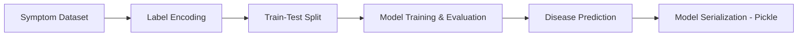
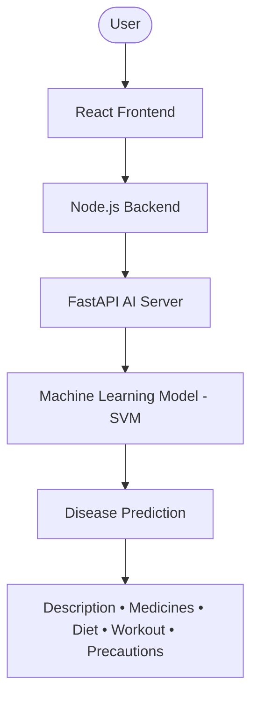

<div align="center">


<br/>


<br/><br/>


</div>

<br/>

## 🧠 About Dr. Neuro

**Dr. Neuro** is an AI-powered healthcare web application built on the **MERN Stack**, **FastAPI**, and **Machine Learning**. It predicts possible diseases from user-selected symptoms and returns descriptions, medications, precautions, diet plans, and workout recommendations — plus an **AI Doctor Chat** for quick health guidance.

<br/>

<div align="center">

</div>

<br/>

## ✨ Features

<table align="center">
<tr>
<td align="center" width="150">🤖<br/><b>AI Disease<br/>Prediction</b></td>
<td align="center" width="150">💬<br/><b>AI Doctor<br/>Chat</b></td>
<td align="center" width="150">💊<br/><b>Medicine<br/>Recommendations</b></td>
<td align="center" width="150">🥗<br/><b>Diet<br/>Suggestions</b></td>
</tr>
<tr>
<td align="center" width="150">🏃<br/><b>Workout<br/>Recommendations</b></td>
<td align="center" width="150">⚠️<br/><b>Disease<br/>Precautions</b></td>
<td align="center" width="150">🔐<br/><b>Secure<br/>Authentication</b></td>
<td align="center" width="150">📱<br/><b>Responsive<br/>MERN App</b></td>
</tr>
</table>

<br/>


## 🤖 AI & Machine Learning

The prediction model is built using **Scikit-learn** and trained on a symptom–disease dataset.

### Libraries Used
- Scikit-learn
- Pandas
- NumPy
- Pickle

### 🔬 ML Pipeline



### Algorithms Tested

| Algorithm | Status |
|---|:---:|
| Support Vector Machine (SVM) | ✅ Final Model |
| Random Forest | 🌲 Tested |
| Gradient Boosting | 🚀 Tested |
| K-Nearest Neighbors (KNN) | 📍 Tested |
| Multinomial Naive Bayes | 📊 Tested |

**Final Model:** Support Vector Machine (Linear Kernel)

The trained model predicts diseases from symptoms and returns:

- 🩺 Disease Name
- 📖 Description
- 💊 Medications
- ⚠️ Precautions
- 🥗 Diet Plan
- 🏃 Workout Suggestions


## 📂 Project Structure

```
Dr-Neuro
│
├── Ai-Mod/                 # FastAPI + AI Model
│   ├── data/
│   ├── predictAi-env/
│   └── main.py
│
├── server/                 # Node.js + Express Backend
│   ├── config/
│   ├── controller/
│   ├── middleware/
│   ├── model/
│   ├── routes/
│   └── utils/
│
└── ui-g/                   # React Frontend
    ├── src/
    ├── public/
    └── package.json
```


## 🚀 Getting Started

### 1️⃣ Start AI Server (FastAPI)

```bash
cd Ai-Mod
python -m uvicorn main:app --reload
```
> Runs at `http://127.0.0.1:8000`

### 2️⃣ Start Backend

```bash
cd server
npm install
npm start
```
> Runs at `http://localhost:4000`

### 3️⃣ Start Frontend

```bash
cd ui-g
npm install
npm run dev
```
> Runs at `http://localhost:5173`


## 🛠 Tech Stack

<div align="center">


</div>

**Frontend:** React.js · Vite · Axios · CSS
**Backend:** Node.js · Express.js · MongoDB · JWT Authentication
**AI:** FastAPI · Python · Scikit-learn · Pandas · NumPy


## 📌 Workflow




## ⚠️ Disclaimer

> Dr. Neuro is developed for **educational and research purposes only**. The predictions and recommendations are generated using Machine Learning and should **not** replace professional medical advice.

<br/>

<div align="center">


**Made with 🧠 + 💙 for smarter healthcare**


</div>
